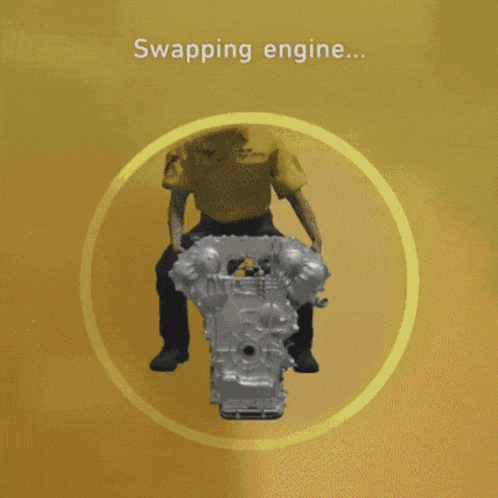

# GT7 Engine Swap Compatibility Tool

  
*A fan-made tool for Gran Turismo 7 enthusiasts*

## 🌍 **Available in 6 languages**  
French | English | Spanish | German | Portuguese | Chinese

## 🚀 **Features**
- 🔍 Instant search by **engine** OR **vehicle**
- 🖼️ Visual results with car thumbnails
- 🌐 Fully translated UI
- 📱 Mobile-friendly design
- 💾 Remembers language preference

## 🛠️ **Tech Stack**
- Vanilla HTML5/CSS3/JavaScript
- Responsive Flexbox/Grid layout
- LocalStorage for preferences
- [Flag icons](https://flagcdn.com/) for language selector

## 🚧 **Planned Improvements**
|||
|---|---|
| 🔧 Advanced filters | (Class, Year, Manufacturer) |
| ⚡ Comparator | Side-by-side swap stats |
| 📊 Performance | Horsepower/PP predictions |

## 🤝 **Contribute**
This is a **passion project** - all feedback welcome!  
How to help:
1. **Report bugs** : [Open an issue](https://github.com/DylanRibet/GT7/issues)
2. **Suggest features** : Contact me via GitHub
3. **Verify data** : Check missing compatibilities

## 📜 **License**
Creative Commons Zero (CC0) - Made for the community ❤️

---

  
*Un outil fait par un passionné pour les passionnés de Gran Turismo 7*

## 🌍 **Disponible en 6 langues**  
Français | English | Español | Deutsch | Português | 中文

## 🚀 **Fonctionnalités**
- 🔍 Recherche instantanée par **moteur** ou **véhicule**
- 🖼️ Affichage visuel avec photos des voitures
- 🌐 Traduit intégralement (textes + interface)
- 📱 Optimisé mobile & desktop
- 💾 Sauvegarde votre langue préférée

## 🛠️ **Technologies utilisées**
- HTML5 / CSS3 / JavaScript vanilla
- Intégration responsive Flexbox/Grid
- LocalStorage pour les préférences
- [Flag icons](https://flagcdn.com/) pour les langues

## 🚧 **Améliorations prévues**
|||
|---|---|
| 🔧 Filtres avancés | (Groupe, Année, Constructeur) |
| ⚡ Comparateur | Côte côte des véhicules compatibles |
| 📊 Stats | Puissance/PP après swap |

## 🤝 **Contribuer**
Ce projet est **open-source** et ouvert aux suggestions !  
Comment aider :
1. **Signaler un bug** : [Ouvrir une issue](https://github.com/DylanRibet/GT7/issues)
2. **Proposer une amélioration** : Contactez-moi via GitHub
3. **Ajouter des données** : Vérifiez les compatibilités manquantes

## 📜 **License**
Creative Commons Zero (CC0) - Fait pour la communauté ❤️
